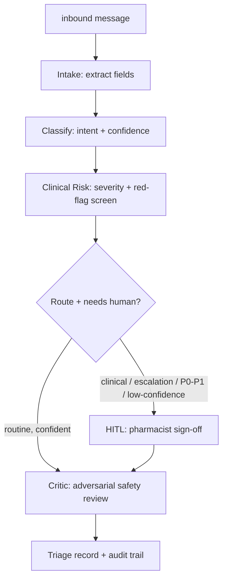

# 💊 Agentic Pharmacy Triage

A multi-agent **LangGraph** pipeline that triages inbound pharmacy messages and
**pauses for a licensed pharmacist on anything life-impacting** — *first, do no
harm*. Clinical reasoning runs on **MedGemma** (a self-hosted medical model),
not a frontier API.

> ⚠️ **Demonstration of an agentic _workflow_ only.** Not medical advice, not a
> medical device. All sample data is synthetic — no PHI. Every clinical decision
> is gated behind a human.

---

## Why this shape

- **Why a graph of agents, not one LLM call?** To *scale triage beyond what
  humans alone can handle*. Each step is independently testable and evaluable,
  models are tiered per step, and — critically — the graph pauses for a human
  *only where it matters*.
- **Why human-in-the-loop?** First, do no harm. A licensed human decides
  anything life-impacting (clinical questions, adverse events, controlled
  substances, high urgency, or low model confidence); the agent handles the
  routine rest.
- **Why a separate risk node?** It screens the **full message** for red-flag
  symptoms *independently of intent* — so *"refill my metformin, also I've been
  thirsty and my vision is blurry"* is caught as possible hyperglycemia even
  though the request is just a refill.

## Pipeline



The **hard stop is structural**: clinical / escalation paths *must* pass through
the human-approval node before the graph can reach `finalize`. It's a gate in the
edges, not a promise in the README.

## Tech

`LangGraph` (StateGraph + `interrupt()` checkpointed human-in-the-loop) ·
`Pydantic` structured outputs · `MedGemma` (self-hosted) · `Gradio` UI.

The model is reached through one small client (`triage/llm.py`) behind a
`MEDGEMMA_URL` env var, so it runs against a self-hosted endpoint, a local
Docker container, or a hosted instance with no code change.

## Run locally

```bash
pip install -r requirements.txt
export MEDGEMMA_URL="https://your-medgemma-endpoint/ask"   # optional override
python app.py            # launches the Gradio UI
```

## Test (offline — no endpoint needed)

```bash
pip install pytest
pytest                   # graph wiring + the first-do-no-harm routing policy
```

## Evaluate (needs a reachable MedGemma endpoint)

```bash
python -m eval.evaluate
```

Headline metric is **recall on the dangerous cases** — we tolerate
over-escalation (alarm fatigue) but never a missed P0.

---

Built by [Charudatta Khamitkar](https://www.linkedin.com/in/ckhamitkar) ·
[portfolio](https://www.axionaiapps.com)
